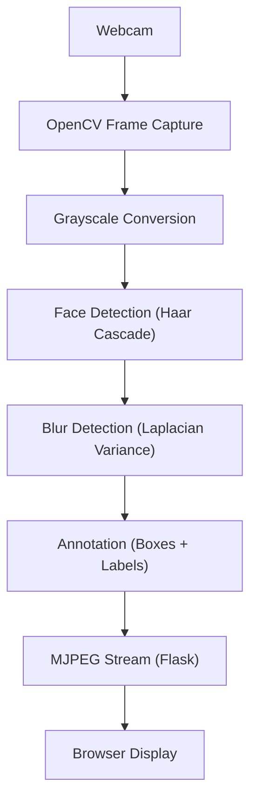

# 🎥 Real-Time Face & Blur Detection System

A real-time computer vision system that detects human faces, evaluates blur quality, and streams live annotated video to a web browser using Flask.

This project focuses on **classical computer vision + real-time systems engineering**, built as part of a pre-deep-learning CV foundation series.

---

## 🔍 Demo


---

## 🚀 Features

-  Real-time webcam capture using OpenCV
-  Face detection using Haar Cascades
-  Blur detection using Laplacian variance
-  CLEAR / BLURRY classification with thresholding
-  Live MJPEG video streaming via Flask
-  Event-based frame saving (only when blur detected)
-  Detection logs with timestamps
-  Stable resource management (camera lifecycle handling)

---

## 🧠 System Architecture



---


<h2>Key frames are saved and detection events are logged in parallel without interrupting the video stream.</h2>

---

## 🛠 Tech Stack

- **Python**
- **OpenCV** – image processing & face detection
- **Flask** – backend web server
- **NumPy** – numerical operations
- **MJPEG Streaming** – real-time video delivery

---

## ▶️ How to Run

### 1. Clone the repository
```bash
git clone <repo-url>
cd project-opencv
```
2. Create virtual environment
```bash
python -m venv venv
source venv/bin/activate  # Windows: venv\Scripts\activate
```

3. Install dependencies
```
pip install -r requirements.txt
```

4. Start the Flask app
```
python src/flask_app.py
```

5. Open in browser
```
http://127.0.0.1:5000
```

📁 Project Structure
```ruby
project-opencv/
│
├── src/
│   ├── run_detection.py        # Local OpenCV pipeline
│   ├── flask_app.py            # Live browser streaming
│
├── assets/
│   └── haarcascade_frontalface_default.xml
│
├── saved_frames/
│   └── blur_YYYYMMDD_HHMMSS.jpg
│
├── logs/
│   └── detections.log
│
├── requirements.txt
└── README.md
```

👉 **Key Engineering Decisions**

* Event-based frame saving instead of saving every frame (prevents I/O overload)
* Generator-based MJPEG streaming for efficient real-time delivery
* Camera ownership inside generator to avoid resource conflicts
* Cooldown logic to prevent repeated frame captures
* Defensive programming to avoid silent stream crashes

👉 **Learning Outcomes**

* Understanding classical CV before deep learning
* Building stable real-time video pipelines
* Integrating OpenCV with web backends
* Debugging generator lifecycle & hardware resources
* Designing CV systems with observability (logs + events)

---

## Project Closure

This project marks the completion of a **pre-deep-learning computer vision foundation**.

By intentionally using classical techniques (Haar cascades, Laplacian variance) and focusing on real-time system behavior, this project builds the intuition required to understand **why modern CV models (YOLO, ViTs) were needed** — not just how to use them.

Rather than optimizing for accuracy, the emphasis was on:
- pipeline design
- system stability
- resource management
- real-world failure modes

This foundation makes the transition to modern deep learning–based vision systems significantly more meaningful and less opaque.

---

## 🚀 Next Direction

- Upgrade face detection to YOLO / DNN-based models  
- Explore Transformer-based vision models (ViT)  
- Build multi-modal systems combining CV + NLP  

This repository is intentionally **closed in scope** to preserve conceptual clarity.

---
